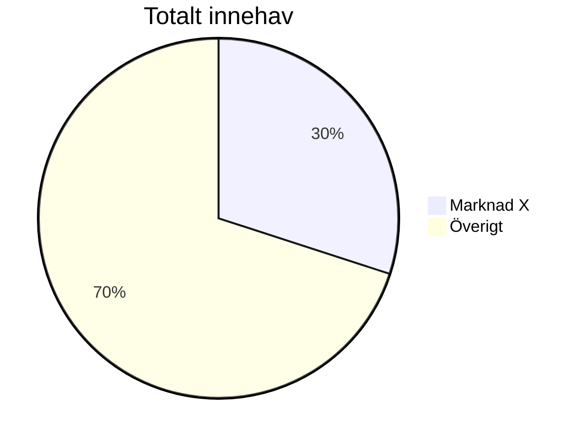

# Strategi för framtida investeringar

## Steg 1
Fördela överskottet på lönen efter kostnader enligt följande:
* Överskott
    * Pensionssparande - Aktier*
    * Övrigt
        * Aktier*
        * Vanligt sparande** (räntemarknaden)

*) Aktiekapital fördelas mellan invesmentbolag och indexfonder, främst fonder i framtidsstarka
regioner (afrika, asien), här kan [ETF-fonder](https://www.avanza.se/lar-dig-mer/avanza-akademin/borshandlade-produkter/vad-ar-hur-fungerar-borshandlade-fonder.html)
från USA vara intressanta.

**) Vanligt sparande sker genom ett vanligt bankkonto med [insättningsgaranti](https://www.riksgalden.se/sv/var-verksamhet/insattningsgarantin-och-investerarskyddet/sa-fungerar-insattningsgarantin/)
hos en mindre aktör som ger högst avkastning på ränktemarknaden.

## Steg 2
Bestäm hur stor del av överskottet som ska gå till pensionssparandet.

## Steg 3
Bestäm hur stor del av de övriga investeringarna som ska gå till aktier kontra räntemarknaden.
denna avvägningen bygger på hur långsiktiga mina besparingar är och hur risktålig jag har
möjlighet att vara.

Långsiktigare investeringar -> Högre andel aktier. \
Högre tålighet mot ev. förluster -> Högre andel aktier.

OBS: Dessa andelar kan komma att ändras med tiden!

## Steg 4
Se över en gång per år hur mina investeringar har rört sig och sälj av/köp nytt för att
återställa den balansen jag har bestämt mig för.

## Steg 5
Pensionssparandet kommer inledningsvis enbart bestå av aktier*, det get bäst avkastning över tid,
men när pensionen närmar sig kommer detta gradvis övergå mot räntemarknaden. Att förlora 40%
av sitt kapital som 70-åring är ju kanske inte att föredra.

# Kapitalfördelning
Ha aldrig mer än 30% av kapitalet i en enskild marknad.

# Buffersparkonto
För att klara av oförutsedda utgifter och för att ha en buffert vid arbetslöshet eller sjukdom
ska jag ha ett buffertkonto med 6 månaders lönekostnad, detta ska vara placerat på ett sparkonto
med hög ränta och insättningsgaranti. Helst ska denna bufferten var snabbt tillgänglig via ett
kort kopplat till kontot.

### Intressanta alternativ för buffertsparkonto
* [Collector Bank](https://www.collector.se/spara-pengar/)
* [Volvo Finans](https://www.volvofinans.se/privat/spara/)
* [Avanza Sparkonto Plus](https://www.avanza.se/sparkonto.html)

### Formel för buffertstorlek
buffert = (nettolön \* 0.8 - ersättning från a-kassa) \* antal arbetslösa månader

#### Exempel
För en person med 28 900 kr i nettolön, som vanligtvis sparar 20% av lönen varje månad, får ut
maximala 14 500 kr/månad från a-kassan och räknar med att vara arbetslös i 6 månader:

buffert = (28 900 \* 0.8 - 14 500) \* 6 = 51 720 kr

# Portföljförslag

## Utdelningsaktier
För att få en bra spridning på mina investeringar och för att minska risken för stora förluster
kommer här en intressant portfölj som ger god riskspridning och med utdelning på samtliga aktier.

Komplettera gärna med utländska bolag eller en billig global indexfond för att få en ännu bättre
riskspridning.

#### Bankbolag
* [Handelsbanken](https://www.handelsbanken.com/sv/investor-relations/aktien/aktiekurs)
* [Swedbank](https://www.swedbank.com/sv/investor-relations/aktien.html)
* [Nordea](https://www.nordea.se/privat/liv/sparande/sa-koper-du-aktier.html)
* [SEB](https://seb.se/privat/spara-och-investera/aktier-och-vardepapper)
#### Investmentbolag
* [Investor](https://www.investorab.com/sv/investerare-media/investoraktien/aktiekurs)
* [Industrivärden](https://www.industrivarden.se/)
* [Lundbergs](https://www.lundbergforetagen.se/sv/investerare/kursutveckling)
#### Konsimtionsbolag
* [H&M](https://hmgroup.com/investors/utdelning/)
* [Axfood](https://www.axfood.se/investerare/aktien/)
#### Fastighetsbolag
* [Castellum](https://www.castellum.se/investerare/aktien/)
* [Hufvudstaden](https://hufvudstaden.se/investerare/aktien/)
* [Atrium Ljungberg](https://www.al.se/om-oss/investerare/aktien/)
#### Teknikbolag
* [Ericsson](https://www.ericsson.com/sv/investors/share-information/the-share)
* [Telia Sonera](https://www.teliacompany.com/sv/artiklar/utdelning)
#### Basindustriföretag (el, skog, etc.)
* [Fortum](https://www.avanza.se/aktier/om-aktien.html/52750/fortum)
* [Holmen](https://www.holmen.com/sv/investerare/Aktien/fakta-om-aktien/)
#### Verkstadsbolag
* [Alfa Laval](https://www.avanza.se/aktier/om-aktien.html/5580/alfa-laval)
* [Atlas Copco](https://www.atlascopcogroup.com/se/investors/atlas-copco-ab-share/share-information)
* [ABB](https://new.abb.com/se/om-abb/aktieinformation)

## Hållbar investering
Här kommer en portfölj med bolag som arbetar aktivt med hållbarhet och som har en god potential
att växa i framtiden. Innehaven är fördelade över 9 bolag i 5 olika branscher.

#### Energiteknik
* [Systemair](https://group.systemair.com/sv/investerare/aktien/)
* [Alfa Laval](https://www.avanza.se/aktier/om-aktien.html/5580/alfa-laval)
* [Afry](https://afry.com/sv/investor-relations/afry-aktien)
#### Energiproduktion
* [Arise](https://www.arise.se/sv/aktien)
#### Fastigheter
* [Castellum](https://www.castellum.se/investerare/aktien/)
#### Finans
* [SEB](https://seb.se/privat/spara-och-investera/aktier-och-vardepapper)
#### Konsumentprodukter
* [Axfood](https://www.axfood.se/investerare/aktien/)
* [H&M](https://hmgroup.com/investors/utdelning/)
* [Husqvarna](https://www.avanza.se/aktier/om-aktien.html/45189/husqvarna-b)

# Aktiesparande i siffror
Årsavkastning: 6.6% \
Månatlig avkastning: 0.56%

#### 100 kr i månaden
| År | Kapital | Vanligt sparande | Diff |
| --- | --- | --- | --- |
| 1 | 1 345 kr | 1 200 kr | 145 kr |
| 2 | 2 675 kr | 2 400 kr | 275 kr |
| 3 | 4 099 kr | 3 600 kr | 499 kr |
| 4 | 5 620 kr | 4 800 kr | 820 kr |
| 5 | 7 247 kr | 6 000 kr | 1 247 kr |
| 10 | 17 240 kr | 12 000 kr | 5 240 kr |
| 20 | 50 739 kr | 24 000 kr | 26 739 kr |
| 30 | 116 213 kr | 36 000 kr | 80 213 kr |
| 40 | 244 181 kr | 48 000 kr | 196 181 kr |

#### 1 000 kr i månaden
| År | Kapital | Vanligt sparande | Diff |
| --- | --- | --- | --- |
| 1 | 13 450 kr | 12 000 kr | 1 450 kr |
| 2 | 26 750 kr | 24 000 kr | 2 750 kr |
| 3 | 40 990 kr | 36 000 kr | 4 990 kr |
| 4 | 56 200 kr | 48 000 kr | 8 200 kr |
| 5 | 72 470 kr | 60 000 kr | 12 470 kr |
| 10 | 172 400 kr | 120 000 kr | 52 400 kr |
| 20 | 507 390 kr | 240 000 kr | 267 390 kr |
| 30 | 1 162 130 kr | 360 000 kr | 802 130 kr |
| 40 | 2 441 809 kr | 480 000 kr | 1 961 809 kr |
| 50 | 4 942 915 kr | 600 000 kr | 4 342 915 kr |

#### Insättning av 10 000 kr som får växa i 50 år
| År | Kapital | Vanligt sparande | Diff |
| --- | --- | --- | --- |
| 1 | 10 660 kr | 10 000 kr | 660 kr |
| 2 | 11 329 kr | 10 000 kr | 1 329 kr |
| 3 | 12 114 kr | 10 000 kr | 2 114 kr |
| 4 | 12 913 kr | 10 000 kr | 2 913 kr |
| 5 | 13 765 kr | 10 000 kr | 3 765 kr |
| 10 | 18 948 kr | 10 000 kr | 8 948 kr |
| 20 | 35 904 kr | 10 000 kr | 25 904 kr |
| 30 | 68 032 kr | 10 000 kr | 58 032 kr |
| 40 | 128 910 kr | 10 000 kr | 118 910 kr |
| 50 | 244 264 kr | 10 000 kr | 234 264 kr |

#### Insättning av 5000 kr varje kvartal
Kvartalsavkastning: 1.6%

| År | Kapital | Vanligt sparande | Diff |
| --- | --- | --- | --- |
| 1 | 20 813 kr | 20 000 kr | 813 kr |
| 2 | 42 990 kr | 40 000 kr | 2 990 kr |
| 3 | 66 621 kr | 60 000 kr | 6 621 kr |
| 4 | 91 801 kr | 80 000 kr | 11 801 kr |
| 5 | 118 632 kr | 100 000 kr | 18 632 kr |
| 10 | 281 590 kr | 200 000 kr | 81 590 kr |
| 20 | 812 921 kr | 400 000 kr | 412 921 kr |
| 30 | 1 815 489 kr | 600 000 kr | 1 215 489 kr |
| 40 | 3 707 232 kr | 800 000 kr | 2 907 232 kr |
| 50 | 7 276 752 kr | 1 000 000 kr | 6 276 752 kr |
